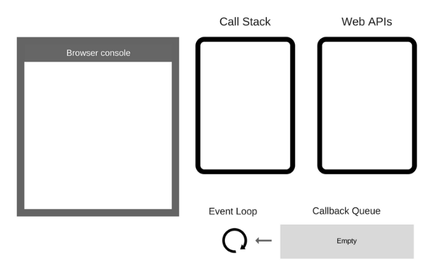

# Sự khác biệt giữa http và https: :high_brightness:

- https chính là http nhưng là 1 phiên bản nâng cấp lên, giúp cho việc bảo mật hơn khi gửi data. Khác nhau chữ s là **secure** tức là bảo mật.
- http gửi dữ liệu ở dạng plain text (văn bảng không được mã hóa hay gọi là văn bảng thô).
- https thì mã hóa dữ liệu rồi gửi đi

# Sự khác biệt giữa local stroge và session stroge: :eight_pointed_black_star:

- LocalStroge lưu trữ giữ liệu vĩnh viễn trên trình duyệt. Ngoại trừ, khi người dùng xóa cache hoặc cài lại trình duyệt thì mới bị mất đi
  > Áp dụng cho việc lưu các thông tin không dính tới bảo mật như là themes, fonts, dashboard, layout, ..v..
- SessionStroge thì giống với LocalStroge nhưng khác là data sẽ bị mất ngay khi tắt 1 cái tab hoặc tắt brower.
  > Áp dụng cho những thứ mang tính tạm thời như chức năng: ghi nhớ sản phẩm trong giỏ hàng, ...v...

# Callback hell là gì? :loop:

- Trong JS cho phép truyền 1 function làm tham số của 1 function khác và thực thi function được truyền vào thì gọi là callback
- Callback hell là tình trạng gọi callback quá nhiều lần, làm cho code khó đọc và khó debug.
  > Đây là lỗi thuộc về coding convention.
- Cách sửa: Chỉ đơn giản là viết lại sao cho dễ đọc hơn. Theo es6 thì có thể dùng await/async. Nói chung là tổ chức lại code cho gọn gàng, dễ hiểu là được.

# Phương thức GET và POST ? :telephone_receiver:

- Dữ liệu của phương thức này gửi đi thì hiện trên thanh địa chỉ (URL) của trình duyệt.
  - HTTP GET có thể được cache bởi trình duyệt.
  - HTTP GET có thể duy trì bởi lịch sử đó cũng là lý do mà người dùng có thê bookmark được.
  - HTTP GET không được sử dụng nếu trong form có các dữ liệu nhạy cảm như là password, tài khoản ngân hàng
  - HTTP GET bị giới hạn số trường độ dài data gửi đi
- Dữ liệu được gửi đi với METHOD POST thì không hiển thị trên thanh URL.
  - HTTP POST không cache bởi trình duyệt
  - HTTP POST không thể duy trì bởi lịch sử đó cũng là lý do mà người dùng không thê bookmark HTTP POST được.
  - HTTP POST không giới hạn dữ liệu gửi đi (gửi ở phần body nên không bị giới hạn)

> POST bảo mật hơn GET vì dữ liệu được gửi ngầm, không xuất hiện trên URL.

> GET vẫn có thể gửi data đi ở phần body được nên GET và POST có thể thay thế nhau.

> Khi dùng phương thức POST thì server luôn thực thi và trả về kết quả cho client, còn phương thức GET ứng với cùng một yêu cầu đó webbrowser sẽ xem trong cached có kết quả tương ứng với yêu cầu đó không và trả về ngay không cần phải thực thi các yêu cầu đó ở phía server. **Http status là 304 not modified**

> Vì có GET có khả năng cached nên sẽ truy xuất và xử lý nhanh hơn để lấy dữ liệu.

# CORS là gì ? :closed_umbrella:

- CORS(Cross-origin resource sharing) là chính sách của trình duyệt dùng để ngăn chặn việc chia sẻ/truy vấn/truy cập vào resource của domain này đối với domain khác.
  - Ví dụ: Bạn tạo ra 1 api và bất kì trang web nào cũng sử dụng. Muốn ngăn chặn việc đó bạn chỉ việc không cho phép CORS thì lúc này nó sẽ giảm không cho các domain, máy chủ khác sử dụng api của bạn.
- Fix lỗi: thông qua các trường HTTP header, khai báo Access-Control-Allow-Origin

# ES6 là gì? :flight_departure:

- Đơn giản mà nói thì nó là quy tắc viết code cho lập trình viên JavaScript.

> Mỗi lập trình viên có mỗi 1 style viết code, cách xử lý mảng/object khác nhau nên khi chia sẽ code cho nhau để đọc sẽ gây ra nhiều rắc rối, chẳng hạn như là mất thời gian đọc để hiểu code đang làm gì. **Nên chính vì vậy sinh ra ES6 là để thống nhất cách viết code lại với nhau.**

> Bạn cứ nghĩ xem hiện nay có khá nhiều trình duyệt Browser ra đời và nếu mỗi Browser lại có cách chạy Javascript khác nhau thì các trang web không thể hoạt động trên tất cả các trình duyệt đó được, vì vậy cần có một chuẩn chung để bắt buộc các browser phải phát triển dựa theo chuẩn đó và đó là ECMAScript

- ES6 gồm có:
  - Variables: dùng **const** và **let** để thay thế cho **var**
  - Arrow Function: `() => {}`
  - Rest parameter: `(name, age, ...other) => { console.log(other) }`
  - Destructuring Assignment: `const [a,b] = [10, 20]`
  - Default Parameters: `(name = 'HieuTran') => { console.log(name) }`
  - Template Literals: Là dấu \`I love ${you}\`
  - Multi-line String
  - Promises: `Promise`
  - Array method: map(), filter(), find(), from(), reduce(), ..v...

# Cách nào để truy vấn dữ liệu nhanh (nhất có thể) khi có nhiều dữ liệu (ví dụ 5tr record trong 1 table)? :ship:

- Đánh index cho table
- Nâng cấp hạ tầng: Vì CSDL được lưu trên ổ cứng vì thế có thể nâng qua các ổ SSD có tốc độ đọc/ghi cao,
- Chia nhỏ nhiều CSDL rồi tổng hợp lại.
- Giới hạn kết quả trả về (tính năng phân trang).
- Chỉ lấy những fields cần thiết cũng là cách để tăng tốc độ truy vấn.
- Caching: Dùng redis.
- Thêm các điều kiện để filter data.

# Single-thread là gì? :brain:

# Bất đồng bộ trong JavaScript là gì ? :bomb:

- Xử lý bất đồng bộ trong JS là nó không chờ đoạn code trước đó thực hiện xong, mà nó sẽ thực hiện luôn đoạn code tiếp theo. Đoạn code nào xong kết qủa trước thì sẽ trả về trước.

> Ví dụ: Bạn nấu 3 món ăn A, B, C. Món A chuẩn bị xong và đưa lên bếp nấu, sau đó lần lượt món B và C cũng đc đưa lên bếp để nấu. Món A xong trước và được dọn lên mâm cơm. Lúc này món B nấu lâu hơn còn món C thì đã nấu xong nên món C sẽ được dọn lên mâm cơm tiếp theo, mặc dù món C được nấu sau món B và cuối cùng món B mới nấu xong thì đưa lên mâm cơm. Vậy thứ tự dọn lên mâm là A C B.



- **CALL STACK** - là một dạng cấu trúc dữ liệu ghi lại vị trí các lệnh đang được thực hiện trong chương trình. Khi lệnh bắt đầu được thực hiện sẽ được đưa vào đỉnh của stack và sau khi thực hiện xong sẽ được lấy ra khỏi ngăn xếp.
- **WEB APIs** - vể bản chất đây chính là các thread mà ta không thể truy cập trực tiếp mà chỉ có thể gọi được đến nó. Các thread này do trình duyệt cung cấp.
- **CALLBACK QUEUE** - là một dạng cấu trúc dữ liệu với nguyên tắc First-In-First-Out (vào trước ra trước).
- **EVENT LOOP** - có nhiệm vụ giám sát tình trạng của CALL STACK và CALLBACK QUEUE.

> Đầu tiên khi chạy 1 đoạn code thì sẽ được đưa vào Call stack, sau đó đoạn code đó sẽ được đưa vào Web APIs **nếu nó do Web APIs cung cấp**, không thì trả về kết quả cho Brower. Sau khi các đoạn code trong Web APIs được thực hiện xong (cái nào xong trước thì ra trước) thì nó sẽ đẩy vào Callback Queue và Event Loop sẽ kiểm tra xem là CallStack đã trống chưa, và nếu rồi thì nó sẽ đẩy đoạn kết quả từ Callback Queue sang Callback. Và thực hiện lại như lúc đầu.

# Kiểu Truthy và Falsy là gì ?

- JavaScript sử dụng Type conversion(chuyển đổi dữ liệu từ kiểu dữ liệu này sang kiểu dữ liệu khác) để ép giá trị bất kỳ thành một giá trị Boolean trong một ngữ cảnh yêu cầu giá trị Boolean.
- Truthy và falsy là những giá trị mà JavaScript khi ép về kiểu Boolean, hoặc trong một ngữ cảnh Boolean, nó sẽ cho ra giá trị true hoặc false.

> **Truthy: chuỗi khác rỗng, số khác 0, tất cả object (bao gồm cả [] và {}).**

> **Falsy: undefined, null, false, 0, -0, 0n, NaN, "".**

# Sự khác nhau giữa toán tử || và ?? :flags:

> Toán tử || (Logical OR): **Sẽ kiểm tra toán hạng bên trái có phải là truthy hay không?** Nếu phải thì trả về toán hạng bên trái, còn không thì trả về toán hạng bên phải.

> Toán tử ?? (nullish coalescing operator): **Sẽ kiểm tra toán hạng bên trái có phải là null hoặc undefined không?** Nếu phải thì trả về toán hạng phải, còn không thì trả về toán hạng bên trái.

# Có bao nhiêu kiểu function trong JS và khác nhau ntn? :dizzy:

- **Declaration Function**: Đây là loại khai báo function cơ bản trong javascript

```javascript
function logAnything() {
	console.log('anything')
}
```

- **Expression Function**: Hay còn gọi là anonymous function (function không tên), là một hàm được sinh ra đúng vào thời điểm chạy của chương trình nếu biến đó được gọi.

```javascript
const anonymousFunction = function () {
	console.log('anonymous function')
}
```

- **Arrow Function**: Hàm này được bổ sung từ ES6.

```javascript
const arrowFunction = () => {
	console.log('arrow function')
}
```

|    Difference     |    Declaration     |          Expression           |             Arrow             |
| :---------------: | :----------------: | :---------------------------: | :---------------------------: |
| Hàm constructor() | :white_check_mark: | :negative_squared_cross_mark: | :negative_squared_cross_mark: |
|     Hoisting      | :white_check_mark: | :negative_squared_cross_mark: | :negative_squared_cross_mark: |
|   context(this)   | :white_check_mark: | :negative_squared_cross_mark: | :negative_squared_cross_mark: |

> Hoisting là cơ chế khi compile javascript sẽ đưa toàn bộ declarations (tức là khai báo biến hoặc function) lên trên đầu scope.

> Trong Expression và Arrow function thì this không tồn tại, còn Declaration function thì this là ngữ cảnh gần nhất với cái hàm gọi nó.

# Cách em phân tích công việc là như thế nào ? :robot:

- Đọc tài liệu của bên product đưa xuống.
- Xem những giao diện có trong docs.
  > Để tìm kiếm những thông tin nào sẽ được hiển thị lên giao diện.
- Đặt câu hỏi là những thông tin đó được lấy ở đâu ra.
  > Trả lời được câu hỏi **thông tin ở đâu ra** thì sẽ biết được chỗ để lấy data rồi hiển thị lên giao diện.
- Xem xét cái yêu cầu này có gây ảnh hưởng tới những giao diện/chức năng nào khác không? Và nếu có thì ảnh hưởng ntn?
- Dựa vào tính năng và điều kiện của yêu cầu thì sẽ biết được là làm API với phương thức nào.
  - Lấy dữ liệu về thì là GET
  - Tạo dữ liệu mới thì là POST
  - Sửa dữ liệu thì là PATCH/PUT.
  - Xóa dữ liệu thì là DELETE.

# Em hay review code của người khác là review gì và làm sao để nó chạy nhanh hơn? :clown_face:

- Review code của người khác, xem có chỗ nào có thể viết lại sao cho dễ đọc hơn không? xem đoạn nào làm cho code chạy chậm thì sửa lại, fomart lại code. Nhưng vẫn đảm bảo mọi thứ chạy đúng như ban đầu.

- Hay xảy ra với xuất file excel. Người cũ thường viết 2 vòng for lồng nhau để tìm giá trị nên dẫn tới data nhiều thì đoạn code chạy lâu.

> Dùng object hoặc Map để lưu data về dạng `[key]: value`, để tìm kiếm cho nhanh.

> Nghĩ cách giảm số lượng vòng for trong 1 block code xuống.

> Dùng Promise.all để đẩy các requests riêng biệt với nhau cùng lúc đi xử lý cũng sẽ tiết kiệm thời gian hơn là tuần tự xử lý từng request.

> Tách các đoạn code logic ra thành 1 file riêng, để tốt cho việc đọc code.
